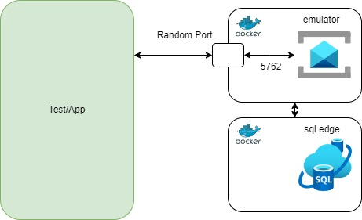
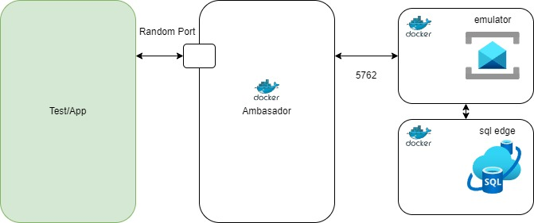

# Using Service Bus Emulator as a Test Container

This project demonstrates how to use the Service Bus Emulator as a test container.

Content:
1. Using Service Bus Emulator - Legal
2. Building Service Bus Emulator as Test Container

## Using Service Bus Emulator - Legal

This Service Bus Emulator test container project is based on the official [Service Bus Emulator](https://github.com/Azure/azure-service-bus-emulator-installer) project.

`Azure Service Bus Emulator` depends on (requires) `Azure SQL Edge Developer Edition` service. 

`Azure Service Bus Emulator` is licensed under [EMULATOR EULA](emulator-legal/EMULATOR_EULA.txt).
`Azure SQL Edge Developer Edition` is licensed under [SQL EDGE EULA](https://go.microsoft.com/fwlink/?linkid=2139274).

Docker Hub page: [https://hub.docker.com/r/microsoft/azure-messaging-servicebus-emulator](https://hub.docker.com/r/microsoft/azure-messaging-servicebus-emulator)

To work with emulator read:
- [EMULATOR EULA](emulator-legal/EMULATOR_EULA.txt)
- [AZURE SQL EDGE EULA](https://go.microsoft.com/fwlink/?linkid=2139274)
- [MIT LICENCE](emulator-legal/LICENSE)
- Accept EULA by setting `ACCEPT_EULA` to `Y` in [src/test/resources/servicebus-emulator.properties](./src/test/resources/servicebus-emulator.properties) file or set as environment variable.

On windows execute:
```powershell
$>Start-Process powershell -Verb RunAs -ArgumentList 'Set-ExecutionPolicy Bypass –Scope CurrentUser'
```

## Building Service Bus emulator as a Test Container

Service Bus emulator does not have a Testcontainers module, and additionally the emulator requires `Azure SQL Edge`.

There are two ways to initialize the Service Bus Emulator as a test container:

1. `code compose` - Composing through code using the GenericContainer class - [AbstractServiceBusContainerCodeCompose](./src/test/java/example/testcontainers/servicebusemulator/code/AbstractServiceBusContainerCodeCompose.java)
2. `docker compose` - Using a Docker Compose file and ComposeContainer class - [AbstractServiceBusContainerDockerCompose](./src/test/java/example/testcontainers/servicebusemulator/docker/AbstractServiceBusContainerDockerCompose.java)

### Key Differences Between the Two Approaches

In the first case, tests or applications interact directly with the ports exposed by the generic emulator and storage test containers.
In the second case, an additional `ambassador` container is created, serving as a proxy to the generic emulator and storage containers.

Code Compose:



Docker Compose:




### Setup
1. Read the legal documents related to using the Service Bus Emulator and Azure SQL Edge Developer Edition 
2. Accept the `EULA` by setting `ACCEPT_EULA` to `Y` in the [servicebus-emulator.properties](./src/test/resources/servicebus-emulator.properties) file or set as environment variable.  
3. Set `SQL_PASSWORD` in the [servicebus-emulator.properties](./src/test/resources/servicebus-emulator.properties) file or set as environment variable. 
4. Adjust the emulator configuration as needed in the [servicebus-emulator-config.json](./src/test/resources/servicebus-emulator-config.json) file. 


**Important:** 
1. The `azure-messaging-servicebus` dependency included in `spring-cloud-azure-starter-servicebus v5.19.0` 
does not support Service Bus emulator connection string and will attempt to use the default AMQP port (5671). 
To work with the emulator, you need to override this dependency and use `azure-messaging-servicebus v7.17.8` .
2. For `JMS`, you need to build a connection factory with emulator parameters because the `jms-servicebus-starter` does not support emulator connection strings.

## Resources

- [Overview of the Azure Service Bus emulator](https://learn.microsoft.com/en-us/azure/service-bus-messaging/overview-emulator)
- [Test locally by using the Azure Service Bus emulator](https://learn.microsoft.com/en-us/azure/service-bus-messaging/test-locally-with-service-bus-emulator?tabs=automated-script)
- [Service Bus Emulator Installer](https://github.com/Azure/azure-service-bus-emulator-installer)
